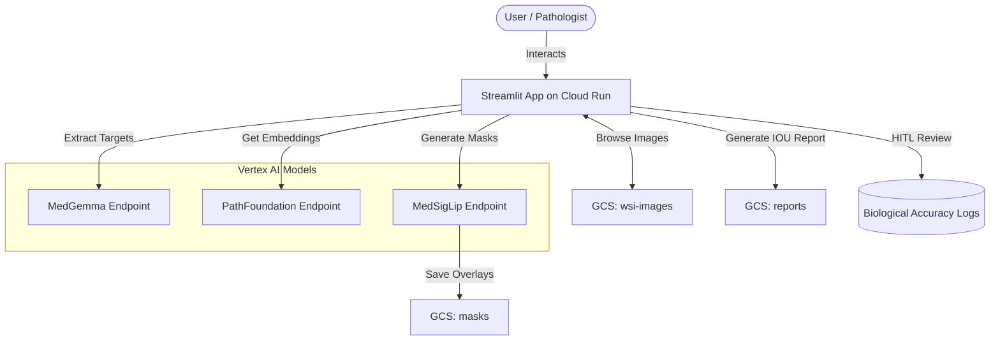

# Medical Imaging Path Foundation Model PoV

The Proof of Value (PoV) for the Medical Imaging Path Foundation Model provides an end-to-end workflow to evaluate Google's pretrained Path Foundation models (like Medgemma and MedSigLip) on Rat and CRC Whole Slide Images (WSIs).

This repository contains both the Infrastructure-as-Code (Terraform) to run it securely on GCP and the Python Streamlit Application for the UI and processing.

## Architecture



## 1. Features

The application provides a modular interface consisting of:
- **GCS Explorer**: Browse and preview Whole Slide Images (WSI) residing in Google Cloud Storage directly from the app.
- **On-Demand Evaluation**: Select a single image to slice into tiles, run inference (mocked gracefully if real endpoints aren't connected yet), generate color masks (Red=Tumor, Green=Normal), and view the visual overlay.
- **Batch Evaluation**: Evaluate multiple images in a GCS folder, simulate tile predictions, and automatically generate an **Intersection Over Union (IOU) Word Report**. The report is saved to GCS and can be downloaded from the UI.
- **HITL Review**: Pathologists can review specific tiles processed during the on-demand phase to explicitly record their True/False Positive/Negative biological accuracy feedback.

## 2. Infrastructure Architecture

The Terraform configurations (`terraform/`) deploy your infrastructure to the target Google Cloud project (`gsk-cmc-hackathon` by default).

**Resources Managed:**
- **GCS Buckets**: For `wsi-images` (input), `masks` (outputs), and `reports` (Word doc generation).
- **Vertex AI Endpoints**: Infrastructure for `medgemma-endpoint` and `medsiglip-endpoint`.
- **Cloud Run Service**: A serverless environment to host the Streamlit web application.
- **Service Accounts & IAM**: Configured to ensure the Cloud Run service has `Storage Admin` and `Vertex AI User` roles.

### How to Deploy Infrastructure
1. Navigate to the terraform directory:
   ```bash
   cd terraform
   ```
2. Initialize and deploy:
   ```bash
   terraform init
   terraform plan
   terraform apply
   ```

## 3. Running the App Locally

To test the application locally without deploying to Cloud Run immediately, ensure you have Google Cloud Application Default Credentials (ADC) configured.

1. **Authenticate with GCP**:
   ```bash
   gcloud auth application-default login
   ```
2. **Install dependencies**:
   ```bash
   cd app
   pip install -r requirements.txt
   ```
3. **Run the Streamlit app**:
   ```bash
   streamlit run app.py
   ```

> **Note**: Since the models and GCS buckets might not exist initially, the application has built-in graceful fallbacks. If the Vertex endpoint ID is set to `mock` in the environment, it will return a dummy embedding and classification (Tumor or Normal) for demonstration purposes.

## 4. Deploying the App to Cloud Run

Once the Terraform infrastructure is provisioned, you can build and deploy the containerized application.

1. **Build and push the Docker image** (using Google Cloud Build or local Docker):
   ```bash
   cd app
   gcloud builds submit --tag us-central1-docker.pkg.dev/gsk-cmc-hackathon/med-imaging-pov-repo/app:latest
   ```
2. **Deploy to Cloud Run**:
   ```bash
   gcloud run deploy med-imaging-pov-service \
       --image us-central1-docker.pkg.dev/gsk-cmc-hackathon/med-imaging-pov-repo/app:latest \
       --region us-central1 \
       --project gsk-cmc-hackathon
   ```

## 5. Next Steps

- **Upload WSI Data**: Upload your `.tif` or `.png` samples of Rat/CRC tissues to the created GCS WSI bucket.
- **Connect Real Models**: Update the `MEDGEMMA_ENDPOINT` environment variable in Cloud Run with the real Model Garden deployed endpoint ID to swap from mock inferences to real ones.
