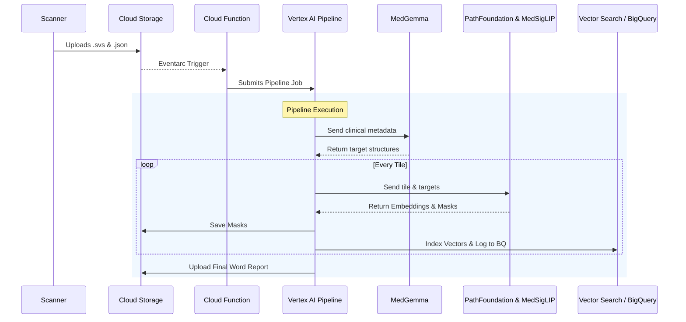

# 🔄 Zero-Shot WSI Pipeline: Detailed Workflow

This document provides a deep dive into the end-to-end technical workflow of the automated histology pipeline.

## 1. Event Trigger & Orchestration

The pipeline is entirely event-driven, operating headlessly without user intervention once deployed.

1. **Upload**: A digital pathology scanner (or user) uploads a Whole Slide Image (`.svs`) and its paired JSON metadata file to the `inputs/` directory of the Cloud Storage bucket.
2. **Eventarc Interception**: Google Cloud Eventarc detects the `google.cloud.storage.object.v1.finalized` event and pushes a notification to the Cloud Function.
3. **Validation & Deduplication**: The Cloud Function checks if *both* the image and the metadata file are present. If one is missing, it goes to sleep. Once both exist, it tags the files with a metadata flag to prevent duplicate runs.
4. **Job Submission**: The Cloud Function dynamically invokes the Vertex AI Pipelines API, passing the URIs of the paired files and submitting the pre-compiled `wsi_pipeline.json` graph for execution.

---

## 2. Phase 1: Metadata Extraction (MedGemma)

The first step of the Vertex AI Pipeline is to understand the clinical context of the slide to guide the zero-shot vision models.

* **Parsing**: The JSON metadata is downloaded and normalized (e.g., standardizing keys like `TissueName` to `TISSUE_NAME`).
* **Prompt Engineering**: The pipeline extracts the Species, Tissue Name, and Patient Diagnosis. It constructs a clinical prompt.
* **LLM Reasoning**: The prompt is sent to **MedGemma** via the Vertex AI Endpoint. MedGemma acts as an expert pathologist, analyzing the diagnosis and returning a comma-separated list of target structures that should be identified in the image (e.g., `"Tumour Epithelium, Necrosis, Healthy Stroma"`).
* **Output**: A flat dictionary containing the normalized metadata and the dynamic `identified_targets` list is passed to the next component.

---

## 3. Phase 2: Vision AI Processing & Indexing

This is the core computational phase where the massive `.svs` file is broken down and analyzed.

1. **WSI Download & Tiling**: The `.svs` file is downloaded to local ephemeral storage. `openslide` reads the image and systematically slices it into `448x448` pixel tiles (or `512x512`, depending on configuration). Blank tiles (empty glass) are skipped to save compute.
2. **PathFoundation Embedding**:
   * Each valid tile is encoded to Base64.
   * It is sent to the **PathFoundation** Vertex AI endpoint.
   * PathFoundation returns a dense mathematical vector (embedding) representing the semantic histological features of that specific tile.
3. **MedSigLIP Zero-Shot Segmentation**:
   * The same tile, along with the `identified_targets` generated by MedGemma, is sent to the **MedSigLIP** endpoint.
   * MedSigLIP performs zero-shot classification and segmentation, returning a visual mask array highlighting exactly where those targets are located in the tile.
4. **Data Persistence**:
   * **Masks**: The mask array is saved as a `.tif` file and uploaded to the GCS `outputs/` bucket.
   * **Vector Search**: The PathFoundation embedding is upserted into the **Vertex AI Vector Search Index**, allowing for future semantic similarity searches ("Find me tiles that look like this one").
   * **BigQuery**: A row is inserted into the `pathology_db.tile_metadata` table linking the Tile ID, Vector ID, Mask URI, and the clinical metadata together for relational querying.

---

## 4. Phase 3: Reporting

After all tiles are processed, the final component synthesizes the results.

* **Document Generation**: Using the `python-docx` library, a Word document is dynamically created.
* **Summary**: It summarizes the run, listing the HEART ID, Diagnosis, Tissue, Stain, the specific targets identified by MedGemma, and the total number of tiles successfully embedded and indexed.
* **Upload**: The finalized report is uploaded to the GCS `outputs/` bucket alongside the generated masks.

---

## 🏗 Summary Diagram

